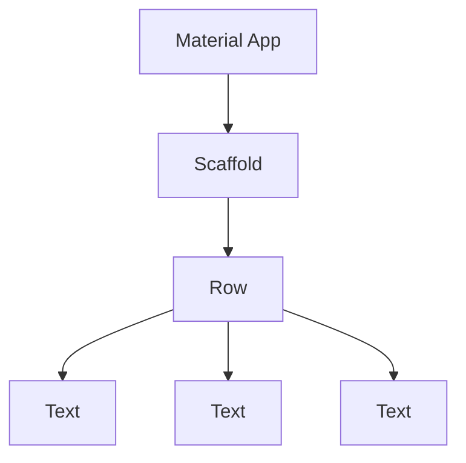

# Dart Basic Fundamentals

Here will be some notes about some concepts that I suppose are interesting to keep noted for future doubts, some things from the course will be disregarded.

---

## NOTES

### Comma

In Dart, you can use a comma at the end of a list of items, and it won't cause an error, this can be super useful for format your code.

---

## `runApp()` and `materialApp()`

`runApp()` is a function that takes a `Widget` and makes it the root of the widget tree. `MaterialApp()` is a widget that provides a number of useful features, including navigation, theming support, and route generation.

### What is a `Widget`?

A `Widget` is a description of part of a *user interface* or a *component*. `Widget` is a core concept in Flutter. Everything is a widget, including the app itself.

All the widgets in Flutter are organized in a hierachy, in other words, a tree of widgets. This tree is called the **widget tree**.

>**NOTE:** You can learn more about `Widget` in the [official documentation](https://flutter.dev/docs/development/ui/widgets-intro) or in this [documentation](https://api.flutter.dev/index.html).

---

## Why use `const`?

The `const` keyword in Dart is used to create constant references, that is, values that cannot be modified after initialization. This ensures *immutability* and *security* in the code, as well as performance optimizations.

> **NOTE:** `const` helps Dart to optimize runtime performance.

