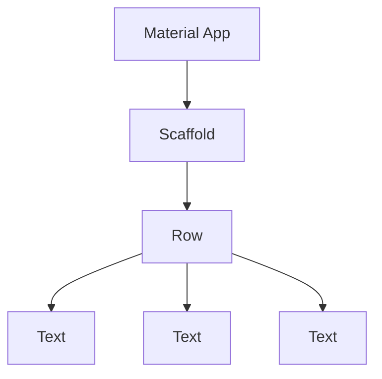

# Dart Basic Fundamentals

Here will be some notes about some concepts that I suppose are interesting to keep noted for future doubts, some things from the course will be disregarded.

---

## NOTES

### Comma

In Dart, you can use a comma at the end of a list of items, and it won't cause an error, this can be super useful for format your code.

---

## `runApp()` and `materialApp()`

`runApp()` is a function that takes a `Widget` and makes it the root of the widget tree. `MaterialApp()` is a widget that provides a number of useful features, including navigation, theming support, and route generation.

### What is a `Widget`?

A `Widget` is a description of part of a *user interface* or a *component*. `Widget` is a core concept in Flutter. Everything is a widget, including the app itself.

All the widgets in Flutter are organized in a hierachy, in other words, a tree of widgets. This tree is called the **widget tree**.



>**NOTE:** You can learn more about `Widget` in the [official documentation](https://flutter.dev/docs/development/ui/widgets-intro) or in this [documentation](https://api.flutter.dev/index.html).

> **NOTE:** You can separete the Widgets in the code for more readability, using `Class` and export to another file, and them import in the main file.

---

## Why use `const`?

The `const` keyword in Dart is used to create constant references, that is, values that cannot be modified after initialization. This ensures *immutability* and *security* in the code, as well as performance optimizations.

> **NOTE:** `const` helps Dart to optimize runtime performance.


---

## `Class`

Classes are the blueprints for creating objects. A class is a structure that defines the data and behavior of objects. It is a template or blueprint from which objects are created.

```dart
class Person {
  // Fields
  int yearsOld;
  String name;

  // Constructor
  Person(this.yearsOld, this.name);

  // Methods
  void method1() {
    // Code
  }
}
```

If your `class` isn't a `widget`, you can use `{}` right after the `class` name to create a class with a constructor and methods. 

If your `class` is a `widget`, you can use `extends` to create a class with some methods and properties from another class. The two most used class ate `StatelessWidget` and `StatefulWidget`.

### `StatelessWidget`

- **Static** and **Unmutable** Widgets
- Useful for elements that don't change over time, like texts, icons, images, etc.
- More *simple* and *eficient*.


### `StatefulWidget`

- **Dynamic** and **Mutable** Widgets
- Useful for elements that change over time, like buttons, forms, etc.
- Can interact with the user and change the state of the widget.


---
