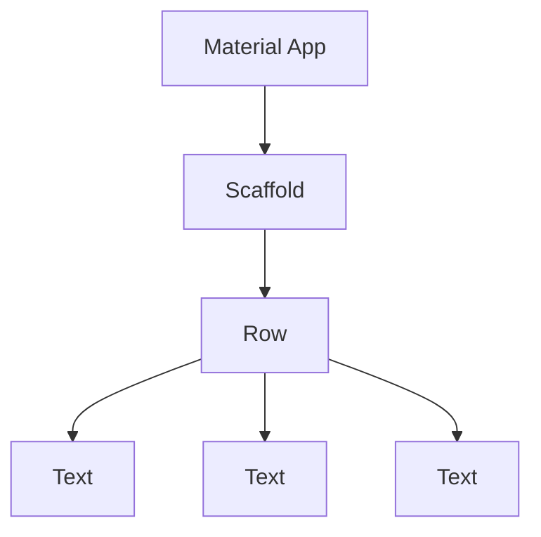

# Flutter/Dart Basic Fundamentals

Here will be some notes about some concepts that I suppose are interesting to keep noted for future doubts, some things from the course will be disregarded.

---

## NOTES

### Comma

In Dart, you can use a comma at the end of a list of items, and it won't cause an error, this can be super useful for format your code.

---

## `runApp()` and `materialApp()`

`runApp()` is a function that takes a `Widget` and makes it the root of the widget tree. `MaterialApp()` is a widget that provides a number of useful features, including navigation, theming support, and route generation.

### What is a `Widget`?

A `Widget` is a description of part of a *user interface* or a *component*. `Widget` is a core concept in Flutter. Everything is a widget, including the app itself.

All the widgets in Flutter are organized in a hierachy, in other words, a tree of widgets. This tree is called the **widget tree**.



>**NOTE:** You can learn more about `Widget` in the [official documentation](https://flutter.dev/docs/development/ui/widgets-intro) or in this [documentation](https://api.flutter.dev/index.html).

> **NOTE:** You can separete the Widgets in the code for more readability, using `Class` and export to another file, and them import in the main file.

---

## Variables

### Why use `var`?

The `var` keyword in Dart is used to declare a variable without specifying its type. The type of the variable will be inferred at runtime. This is useful when you don't know the type of the variable at compile time.

### Why use `const`?

The `const` keyword in Dart is used to create constant references, that is, values that cannot be modified after *initialization* (**compiled**). This ensures *immutability* and *security* in the code, as well as performance optimizations.

> **NOTE:** `const` helps Dart to optimize runtime performance.

### Why use `final`?

The `final` keyword in Dart is used to declare a variable that cannot be changed after it has been initialized. This is useful when you want to ensure that a variable will not be modified after it has been initialized.

### What is the difference between `const` and `final`?

The `const` keyword is used to create constant values, while the `final` keyword is used to create variables that cannot be changed after they have been initialized. In other words, `const` is used to create constant values, while `final` is used to create constant variables.

---

## `Class`

Classes are the blueprints for creating objects. A class is a structure that defines the data and behavior of objects. It is a template or blueprint from which objects are created.

```dart
class Person {
  // Fields
  int yearsOld;
  String name;

  // Constructor
  Person(this.yearsOld, this.name);

  // Methods
  void method1() {
    // Code
  }
}
```

If your `class` isn't a `widget`, you can use `{}` right after the `class` name to create a class with a constructor and methods. 

If your `class` is a `widget`, you can use `extends` to create a class with some methods and properties from another class. The two most used class ate `StatelessWidget` and `StatefulWidget`.

### `StatelessWidget`

- **Static** and **Unmutable** Widgets
- Useful for elements that don't change over time, like texts, icons, images, etc.
- More *simple* and *eficient*.

```dart
class MyWidget extends StatelessWidget {
  @override
  Widget build(BuildContext context) {
    return Container(
      child: Text('Hello World'),
    );
  }
}
```

### `StatefulWidget`

- **Dynamic** and **Mutable** Widgets
- Useful for elements that change over time, like buttons, forms, etc.
- Can interact with the user and change the state of the widget.

```dart	

class MyWidget extends StatefulWidget {
  const MyWidget({super.key});

  @override
  State<MyWidget> createState() => _MyWidgetState();
}

class _MyWidgetState extends State<MyWidget> {
  @override
  Widget build(BuildContext context) {
    return Container(
      child: Text('Hello World'),
    );
  }
}
```


---

## Images

### Adding Images

To add images to your Flutter app, you can use the `Image` widget. The `Image` widget can be used to display images from the internet, from the local file system, or from the app's assets.

>**IMPORTANT:** If you want to use images from your assets, you need to add the images to the `pubspec.yaml` file.

> **NOTE:** You can use the `Image.asset()` to load images from the assets folder.

---

## Column and Row

### `Column`

The `Column` widget is used to display a list of children in a vertical arrangement. The `Column` widget is a flexible widget that can be used to create complex layouts.

>**NOTE:** By default, occupies the **entire available height** but only width required by its children.

### `Row`

The `Row` widget is used to display a list of children in a horizontal arrangement. The `Row` widget is a flexible widget that can be used to create complex layouts

>**NOTE:** By default, occupies the **entire available width** but only height required by its children.

---

## Buttons

### `ElevatedButton`

The `ElevatedButton` widget is a material design button that is elevated above the surface of the screen.

>**NOTE:** Has a background color, shadow and elevation.

### `OutlinedButton`

The `OutlinedButton` widget is a material design button that is outlined.

>**NOTE:** Has no background color, but a border.

### `TextButton`

The `TextButton` widget is a material design button that is only some pressable text.

#### OnPressed

In all the buttons, you can use the `onPressed` property to define a function that will be called when the button is pressed.

```dart	
ElevatedButton(
  onPressed: () { // Anonymous function
    // Code
  },
  child: Text('Button'),
)
```
